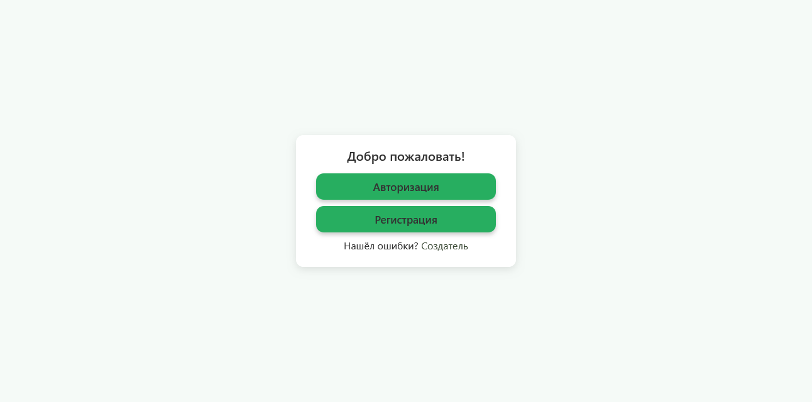
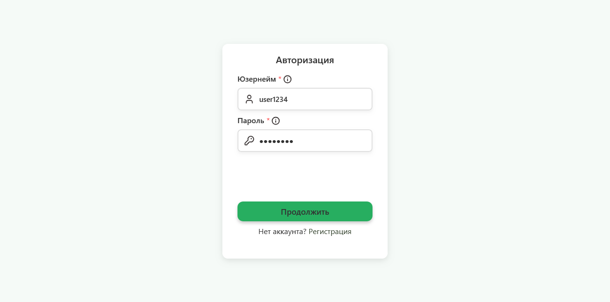
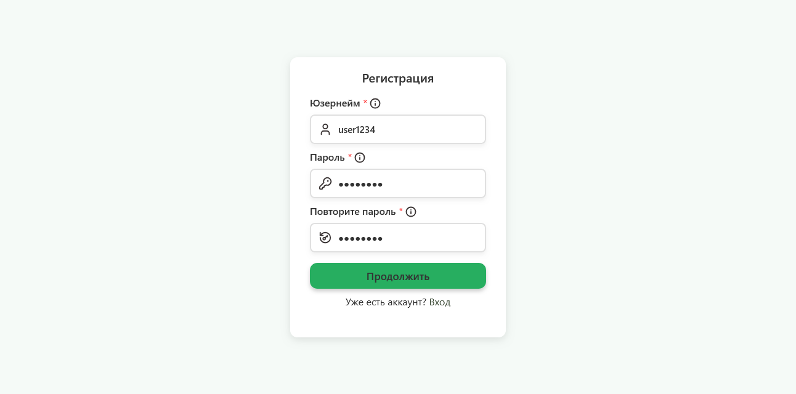
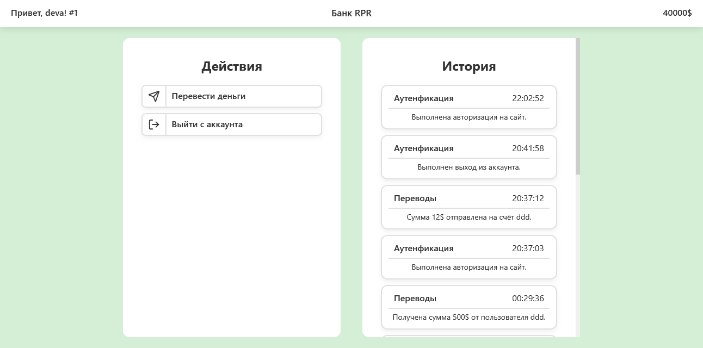
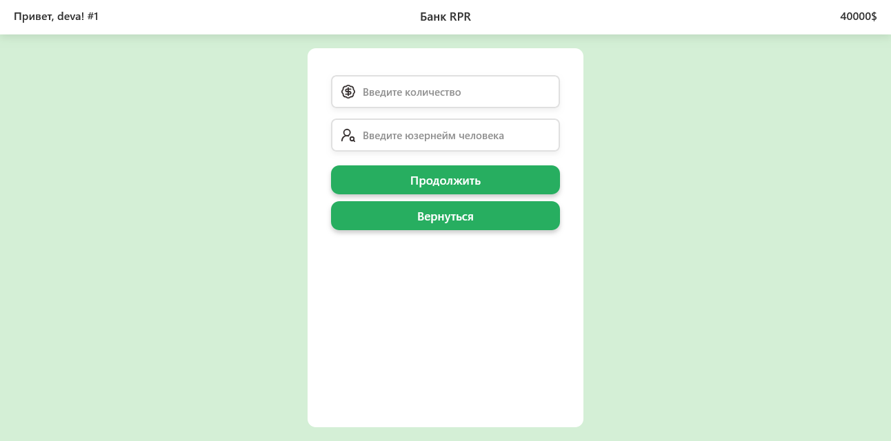

## Использование
- Для установки зависимостей используйте ```npm install```
- Для запуска воспользуйтесь ```npm start```

---

## Интерфейс
- Банк сделан только под десктопные устройства.
- Мобильные будут либо плохо показывать, либо вовсе не работать, или показывать не весь контекст.
- Если вы продвинутый, то добавьте параметр zoom: 0.75; в стили по пути static/css/global.css в * для поддержки мобильных в горизонтальном положении.

# Предварительный просмотр
- Главная страница
---

- Вкладка авторизации
---

- Вкладка регистрации
---

- Главная вкладка аккаунта
---

- Вкладка отправки монет
---

